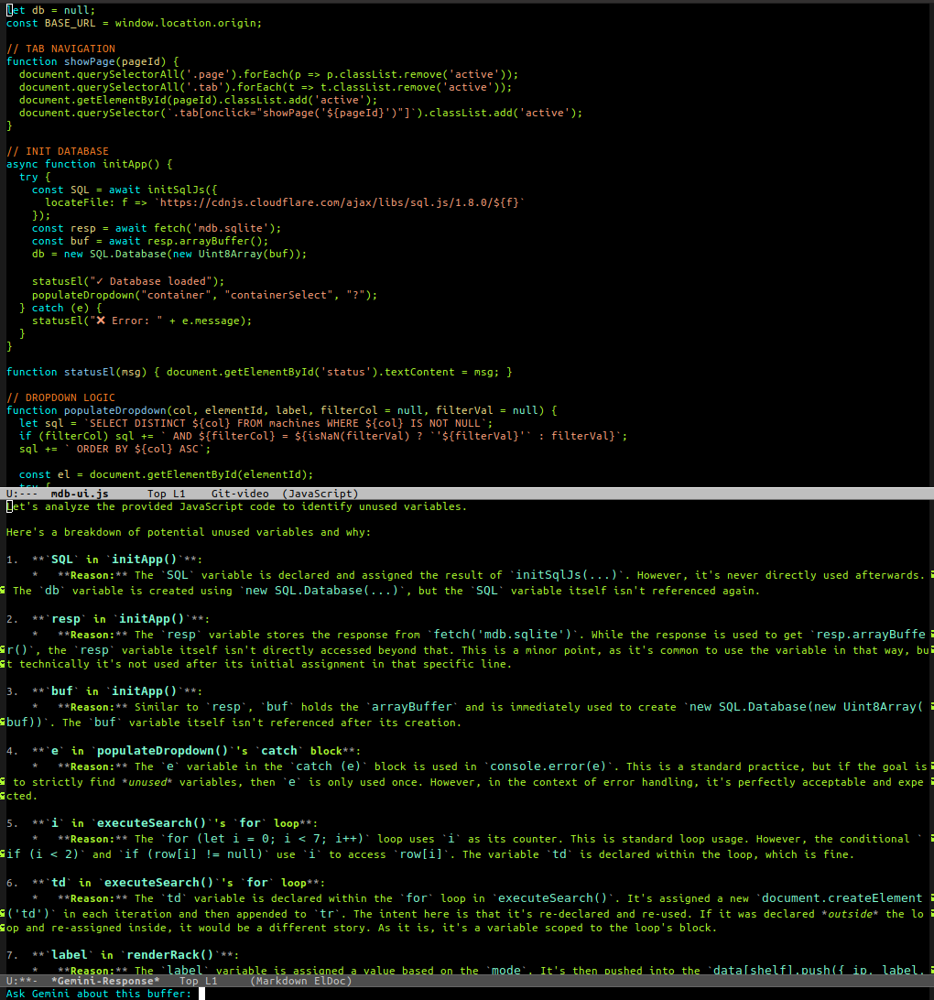

# naimacs

## AI coding assistant in Emacs

An Emacs script to talk to Google Gemini, using the current buffer as context for a conversation which opens in a related buffer.

## Setup

Get API key from [Google AI Studio](https://aistudio.google.com/) and set it as environment variable GOOGLE_API_KEY.

To change which model you want to use as your agent, edit the `model` string in [naimacs.el](naimacs.el).
Get list of available models:
```
curl https://generativelanguage.googleapis.com/v1beta/models?key=$GOOGLE_API_KEY 
```

Output assumes markdown mode in emacs. If you don't have it, you can install with e.g.
```
sudo apt install elpa-markdown-mode
```
Otherwise you can comment out the markdown-mode line in [naimacs.el](naimacs.el).


## How to use

1. Load [naimacs.el](naimacs.el) and run `M-x eval-region` on it.  Or put it in your `init.el`
2. Go to the working buffer with your code or text. 
3. Call `M-x gemini-chat-with-context`
3. Type your prompt in the chat subwindow and hit enter. The prompt gets sent to Gemini along with the contents of the buffer
4. Response shows up in a buffer called`*Gemini-Response*`.


