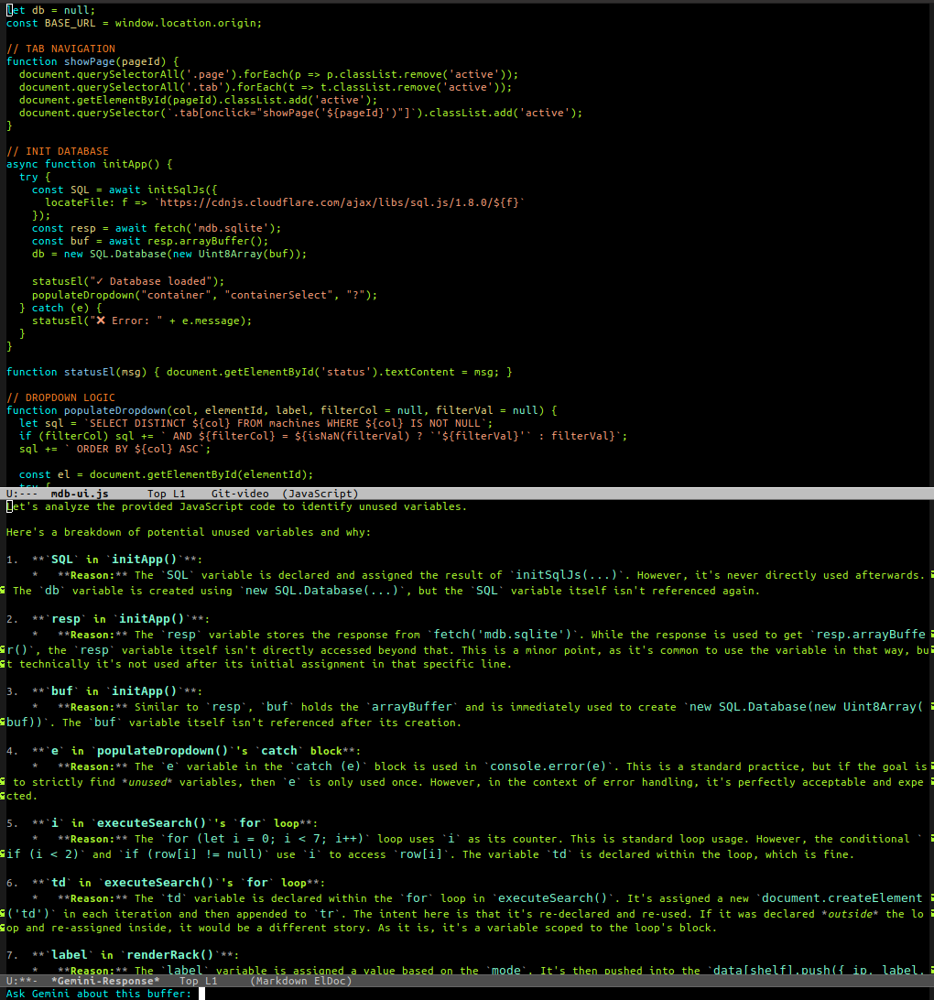

# naimacs

## AI coding assistant in Emacs

An Elisp script to talk to Google Gemini, using the current buffer as context for a conversation which opens in a related buffer, or to generate and insert code directly into your file.

You can also save and load these conversations to disk, allowing you to maintain context across multiple projects.

## Setup

Get API key from [Google AI Studio](https://aistudio.google.com/) and set it as environment variable GOOGLE_API_KEY.

Output assumes markdown mode in emacs. If you don't have it, you can install it with e.g.
`sudo apt install elpa-markdown-mode`.
Otherwise you can comment out the markdown-mode line in [naimacs.el](naimacs.el).

Load [naimacs.el](naimacs.el) and run `M-x eval-buffer` on it.  Or put it in your `init.el` :
```
(load-file "~/.emacs.d/naimacs.el")
```

Define keyboard shortcuts (optional):
```
(global-set-key (kbd "C-c g") #'naimacs-chat-with-context)
(global-set-key (kbd "C-c i") #'naimacs-insert-at-point)
(global-set-key (kbd "C-c h") #'naimacs-show-conversation-history)
(global-set-key (kbd "C-c c") #'naimacs-clear-conversation-history)
(global-set-key (kbd "C-c s") #'naimacs-save-conversation-history)
(global-set-key (kbd "C-c l") #'naimacs-load-conversation-history)
```

## How to use

1. Go to the working buffer with your code or text.
2. Call `M-x naimacs-chat-with-context` to chat in a separate buffer, or `M-x naimacs-insert-at-point` to have Gemini write code directly at your cursor.
3. Type your prompt in the minibuffer and hit enter. The prompt gets sent to Gemini along with the contents of the buffer (or the currently selected region if any)
4. Response shows up in a buffer called `*Gemini-Response*`, or is inserted directly into your text.

You can also:

5. Clear history: `M-x naimacs-clear-conversation-history`
6. View history: `M-x naimacs-show-conversation-history`
7. Change models: `M-x naimacs-set-model`
8. List models: `M-x naimacs-list-models`
9. Save history: `M-x naimacs-save-conversation-history`
10. Load history: `M-x naimacs-load-conversation-history`

*Note on History Management:* Saving and loading defaults to a `.naimacs_history` file in your current directory, making it easy to keep project-specific contexts. naimacs will prompt you to save your current conversation before you clear or overwrite an active history.


